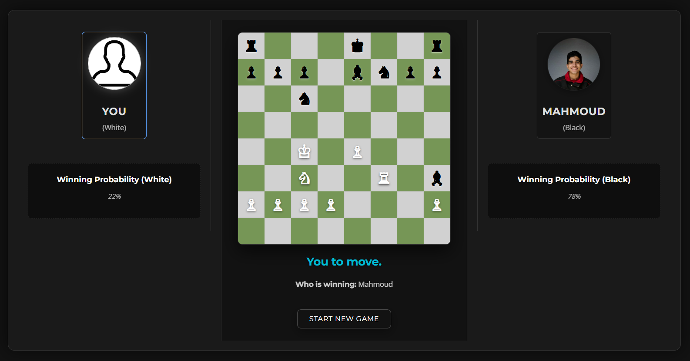
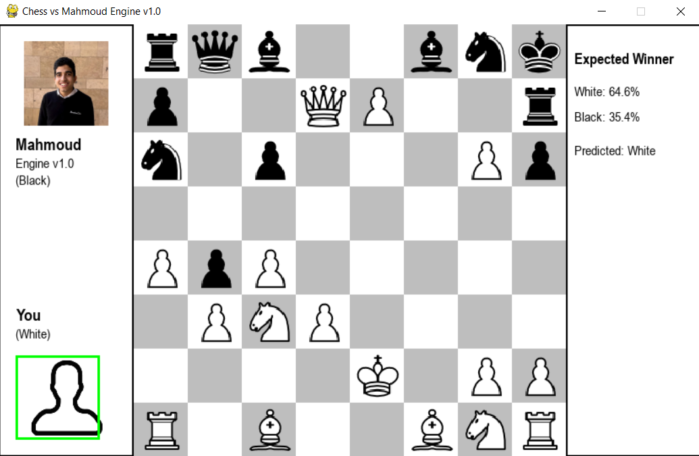

  <a href="https://mahmoudhossamws.github.io/Mahmoud_Chess_Engine_Web/" target="_blank" rel="noopener" style="text-decoration:none;">
    🌐 Visit Website
  </a>
  <a href="https://drive.google.com/file/d/17PBX1-uNQafle0HKlBocnyvw1g0re3ry/view?usp=sharing" target="_blank" rel="noopener" style="text-decoration:none;">
    💾 Download Windows App
  </a>

# ♟️ Mahmoud Chess Engine v1.0

A neural network–powered chess engine that selects moves using a convolutional neural network (CNN) trained on game outcomes. This project is a demonstration of a **purely supervised learning approach** to chess AI and is **open for collaboration**!

---

## 🧠 Approach: Pure Supervised Learning

- **Data Preparation:**  
  Positions are extracted from real chess games (PGN files) and encoded as 8x8x12 tensors. Each position is labeled with the final game result (1 for White win, 0 for Black win).

- **Model Architecture:**  
  A CNN predicts the probability that White will win from any given position. The model is trained with binary cross-entropy loss using only the final outcome as the label.

- **Move Selection:**  
  For every legal move, the engine simulates the move, encodes the resulting board, and uses the neural network to estimate the win probability for White. The move with the highest (or lowest, for Black) predicted probability is chosen.

- **No Search or Lookahead:**  
  The engine does **not** perform any tree search or tactical lookahead. It relies entirely on the neural net’s evaluation of single positions.

---

## 🤖 Performance results

Mahmoud Chess Engine v1.0 demonstrates **intermediate performance** for a neural network chess engine that relies purely on supervised learning, with no search or handcrafted evaluation logic. The engine generally avoids basic blunders, develops pieces sensibly, and maintains a reasonable grasp of material balance and king safety. Its pattern recognition allows it to play at a level suitable for casual and intermediate players, but it does not reach the tactical sharpness or strategic depth of advanced search-based engines. In summary, while not especially smart or practical in all situations, the engine provides a solid, intermediate-level chess experience for most users.

## 🔭 Future Plans

- **Integrate Search Algorithms:**  
  Combine the neural network with a search algorithm (e.g., minimax or alpha-beta) to evaluate move sequences, not just single positions.

- **Self-Play and Reinforcement Learning:**  
  Explore reinforcement learning to allow the engine to learn from its own games, not just static labels.

- **Model Architecture Enhancements:**  
  Experiment with deeper or more specialized neural network architectures.

---

## 🤝 Open for Collaboration!

**Mahmoud Chess Engine v1.0 is open source and welcomes collaborators!**  
Whether you want to improve the neural network, add search, enhance the training pipeline, or just experiment, your contributions are encouraged.

- **How to contribute:**  
  - Fork the repository
  - Open issues or pull requests with your suggestions or improvements
  - Discuss ideas and future directions

If you want to become a collaborator, please [open an issue](https://github.com/mahmoudhossamws/Mahmoud-Chess-engine/issues) or contact me directly.

---

## 🌐 Website

The project's website frontend is built using HTML, CSS and JavaScript and is hosted on GitHub Pages. The model that powers functionality on the site is hosted on Hugging Face Spaces and is used via its API.

🔗 [Visit the Website](https://mahmoudhossamws.github.io/Mahmoud_Chess_Engine_Web/)

---

## 🖥️ Desktop App

The Windows desktop application is a standalone build of the engine with a Pygame-based user interface.

- UI library: Pygame (the desktop app uses Pygame for rendering and input handling)
- Run (development): install Python 3.8+ and Pygame, then run `project.py` (this launches the Pygame UI)
- Distribution: a packaged Windows executable is provided as a zip (link below)

🔗 [Download Mahmoud Chess Engine v1.0 (.zip, Google Drive)](https://drive.google.com/file/d/17PBX1-uNQafle0HKlBocnyvw1g0re3ry/view?usp=sharing)

Unzip and run `project.exe` inside the extracted folder.

---

##  Contact

For questions, feedback, or collaboration requests:  
📧 **mahmoudhossam@aucegypt.edu**

---

